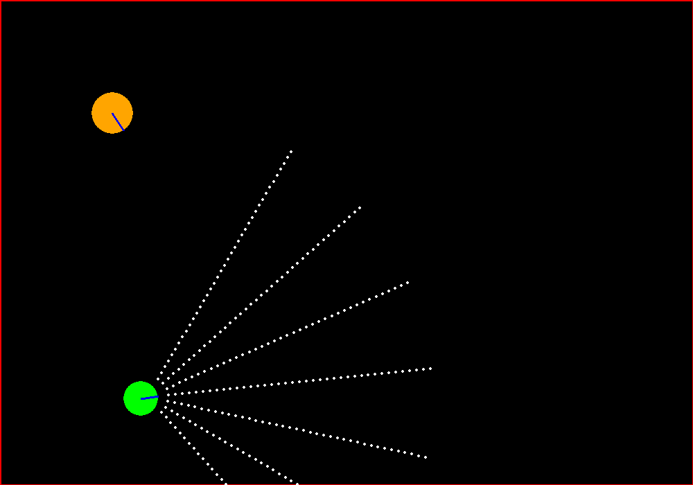
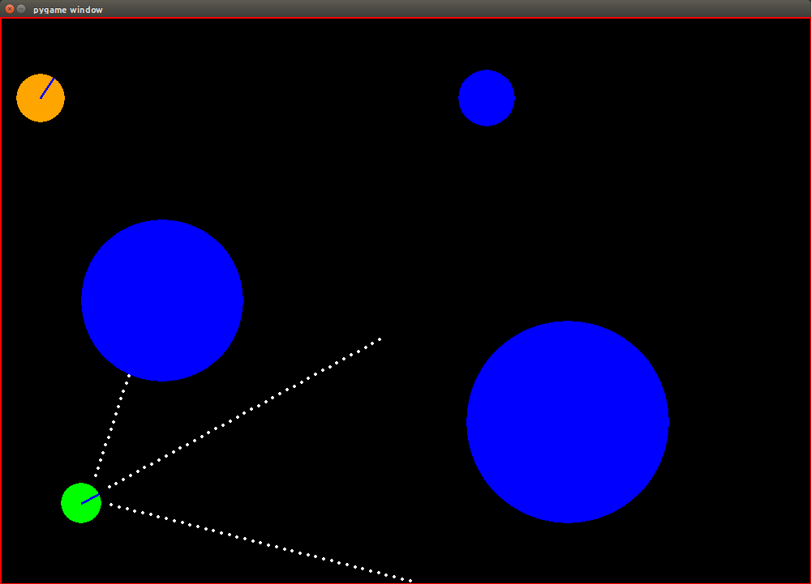
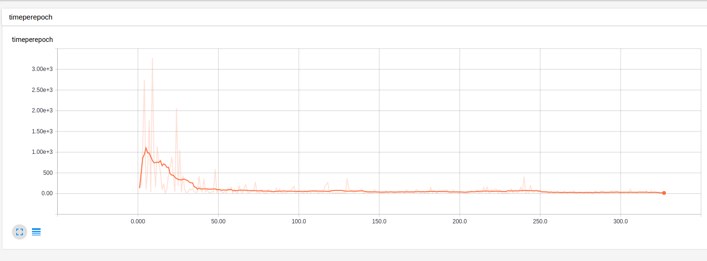

I am trying a very ambitious problem in one of my Robotics Course project. The aim
is to land a UAV on a moving UGV using Reinforcement Learning. The idea behind the
whole process was quite vague so I started using my course project as a way to familiarize myself with the ongoing RL research.

Then I got lost!

So much in last 3 years. One has to start minimally in this vast ocean of literature.
I am thankful to a large number of blogs from which I have learnt immensly. This is just my way of extending the knowledge.
Here In this blog post I intend to show you how to completely run a simple AI game in Python and train it using Tensorflow.


### Objective:
We have an agent that has a set of Sonar sensors attached to its front. There is a target performing random walk. We want our agent to home in the target and kill it as swiftly as possible.

The game should look something like this.



To even think about creating something like this, I am grateful to Matt Harvey's [RL blog series](https://medium.com/@harvitronix/using-reinforcement-learning-in-python-to-teach-a-virtual-car-to-avoid-obstacles-6e782cc7d4c6#.ihcdue9fu) and also my friend [Hardik](http://goelhardik.github.io/) as a source of inspiration for this work. The base code for the game can be taken from [Matt's github link](https://github.com/harvitronix/reinforcement-learning-car/blob/master/flat_game/carmunk.py) and will serve as our starting point. He trained using Keras as the Neural Net library but I prefer Tensorflow and the other parts of the code will vary as we will see how to implement bunch of cool things like.

* Experience Replay.
* Epsilon Annealing.

The above points were discovered in the famous Deepmind's Atari paper. We will go over each one in detail later below.

#### Tweaking the game.
Get the `carmunk.py` from the above github link and try running it directly, it will show something like this.



We just need to remove the blue obstacles and increase the number of sonar sensors to get the target configuration. Also we need to tweak the reward system as originally, Matt trained this for avoiding the obstacles but we want to home in the orange target.

There are only 3 changes we need here:

* In the `class GameState` :

``` python
class GameState:
def __init__(self):
self.obstacles = [] # Just comment out the 3 obstacles.
# self.obstacles.append(self.create_obstacle(200, 350, 100))
# self.obstacles.append(self.create_obstacle(700, 200, 125))
# self.obstacles.append(self.create_obstacle(600, 600, 35))
```

* In function `get_sonar_readings` :

```python
def get_sonar_readings(self, x, y, angle):
# Make our arms.
arm_left = self.make_sonar_arm(x, y)
arm_middle = arm_left
arm_right = arm_left

# Add more sonar arms for our purpose.
arm_left1 = arm_left
arm_left2 = arm_left
arm_right1 = arm_left
arm_right2 = arm_left

# Rotate them and get readings.
readings.append(self.get_arm_distance(arm_left, x, y, angle, 0.75))
readings.append(self.get_arm_distance(arm_middle, x, y, angle, 0))
readings.append(self.get_arm_distance(arm_right, x, y, angle, -0.75))

# Readings for the extra arms that we added above for our case.
readings.append(self.get_arm_distance(arm_left1, x, y, angle, 0.25))
readings.append(self.get_arm_distance(arm_left2, x, y, angle, 0.50))
readings.append(self.get_arm_distance(arm_right1, x, y, angle, -0.25))
readings.append(self.get_arm_distance(arm_right2, x, y, angle, -0.50))

if show_sensors:
        pygame.display.update()

return readings
```

* In function `car_is_crashed` :

``` python
def car_is_crashed(self, readings):
        # Since now we have 7 sensors, not 3
        if np.min(readings) == 1:
                return True
        else:
                return False
```


If you now try running the file, it will look exactly as the configuration we wanted from the start. Now we need to change the reward system.

Few things to note here.

1. We reward the agent (green) whenever it detects the orange random walker via any of its arms.
2. But we still want to avoid hitting the walls.
3. The highest reward is provided when the sonar get to its nearest possible distance to the random walker. This is termed as the crash state and is good for our system.

Now we want to reward the agent when the orange cat is detected and penalize it when detecting the walls. Now, remember that the reward function is a single scalar value and our sensors are sonars that is, they only provide the distance information to the obstacle. This suggests that the reward function needs more information than just the distance.

Implementing this would be slightly complicated. Trying something simpler and see how the DQN performs would be a good starting point.

Let's treat walls as invisible and provide reward whenever the orange cat is detected. Once we get this working, we can get the slightly complicated version too.

This will require few more changes here:

``` python
def frame_step(self, action):
        ...
        ...
   # Set the reward.
   # Car crashed when any reading == 1
   if self.car_is_crashed(readings):
       self.crashed = True
       reward = 500 # Not -500
       self.recover_from_crash(driving_direction)
   else:
       # Higher readings are not good, so multiply by a negative value.
       reward = -5 * np.min(readings)

        ...
        ...
```

``` python
def get_arm_distance(self, arm, x, y, angle, offset):
...
...

# Check if we've hit something. Return the current i (distance)
# if we did. If the sensor is off the screen, we treat it as if there is
# no obstacle.
if rotated_p[0] <= 0 or rotated_p[1] <= 0 \
    or rotated_p[0] >= width or rotated_p[1] >= height:
        i = i + 0# return i  # Sensor is off the screen.
else:
        obs = screen.get_at(rotated_p)
        if self.get_track_or_not(obs) == 1:
                return i

...
...
```

Now let us move onto the Tensorflow structure.


``` python
 import tensorflow as tf
 import numpy as np


 class NN():

     def __init__(self, input_shape, output_shape):
         """In case of Q learning, the input_shape is size of state space and the
         output_shape denotes the size of the action space. """
         self.input_shape = input_shape
         self.output_shape = output_shape

     def placeholder_inputs(self, batch_size):
         """ self.input_shape inputs and 3 outputs. But the label for each state
         would be the correct action's index. """

         input_placeholder = tf.placeholder(
             tf.float32, shape=(batch_size, self.input_shape))
         nextQ = tf.placeholder(tf.float32, shape=(
             batch_size, self.output_shape))
         return input_placeholder, nextQ

     def inference(self, input_placeholder, h1_size, h2_size):
         """ Layout the shape of the NN in the inference. """

         # Hidden 1
         with tf.name_scope('hidden1'):
             weights = tf.Variable(tf.truncated_normal(
                 [self.input_shape, h1_size], stddev=1.0 / self.input_shape))
             hidden1 = tf.nn.relu(tf.matmul(input_placeholder, weights))

         # Hidden 2
         with tf.name_scope('hidden2'):
             weights = tf.Variable(tf.truncated_normal(
                 [h1_size, h2_size], stddev=1.0 / self.input_shape))
             hidden2 = tf.nn.relu(tf.matmul(hidden1, weights))

         # Linear
         with tf.name_scope('linear'):
             weights = tf.Variable(tf.truncated_normal(
                 [h2_size, self.output_shape], stddev=1.0 / self.input_shape))
             Qout = tf.matmul(hidden2, weights)
             #predict = tf.argmax(Qout, 1)
         return Qout

     def loss_val(self, Qout, nextQ):
         """ Qout and nextQ both are the Q values for the same action just
         calculated in different ways, that's all."""
         loss = tf.reduce_mean(tf.pow(tf.sub(nextQ, Qout), 2.0))
         return loss

     def training(self, loss, learning_rate):
         """ Returns the ops needed to minimize the loss via Gradient Descent. """
         optimizer = tf.train.RMSPropOptimizer(learning_rate)
         train_op = optimizer.minimize(loss)
         return train_op


```

 This is a standard neural network structure in Tensorflow. We have 2 hidden layers here. Also, It is important not to fix the size of the input placeholders as sometimes we might need to feed a minibatch of data and sometimes just a single input. For training, instead of using a simple gradient descent based back-propagation, we use RMSPropOptimizer. Check [here](http://www.cs.toronto.edu/~tijmen/csc321/slides/lecture_slides_lec6.pdf) for an overview of minibatch gradient descent methods.

 Now that we have the environment and the function approximator (the NN) ready, it is time to write the Q-learning code for an Agent class.

```python

 class Agent():

     def __init__(self):
         self.game = carmunk.GameState()
         self.episodes_length = 10000
         self.nn = NN(7, 3)
         self.gamma = 0.9

         # Generate the necessary tensorflow ops
         self.inputs1, self.nextQ = self.nn.placeholder_inputs(None)
         self.Qout = self.nn.inference(self.inputs1, 128, 32)
         self.loss = self.nn.loss_val(self.Qout, self.nextQ)
         self.train_op = self.nn.training(self.loss, learning_rate=0.01)

         self.time_per_epoch = tf.placeholder(tf.float32, shape=())
         self.init = tf.initialize_all_variables()
         self.saver = tf.train.Saver()

         # Generate the requisite buffer
         self.experience_memory = 10000
         self.replay = []

         self.minibatch_size = 128
         self.epsilon = 0.9

         # self.saver.restore(self.sess, "newmodel1.ckpt")
         self.logs_path = '/tmp/tensorflow_logs/example20'

         # Create a summary to monitor loss tensor
         tf.scalar_summary("timeperepoch", self.time_per_epoch)
         # Merge all summaries into a single op
         self.merged_summary_op = tf.merge_all_summaries()

```

 So this part covers the parameters that we are using currently. There are 7 sensors so the input to the first layer is 7. Similarly, there is a possibility of only 3 actions which are left rotation + 1 move forward, right rotation + 1 move forward and no rotation but just a move in the forward direction. For this reason, we have 3 neurons in the output layer. The two hidden layers with size 128 and 32 are chosen arbitrarily. The learning rate of 0.01 has worked well for me. The size of the experience buffer is 10000. The minibatch size we use for training is 128. Epsilon provides us information about how much exploration we want with respect to the exploitation (More on exploration vs exploitation later). Also, to see if we are learning well here we need to visualize the time it takes to end per game. Ending a game would mean how fast our agent is able to kill the target. As we learn, we expect this time to decrease. The log files are written in the `self.logs_path` and can be visualized using tensorboard.

```python
# Forward Propagation
def StoQ_FApprox(self, state):
         return self.sess.run(self.Qout, feed_dict={self.inputs1: state})

# Backward Propagation ~ Training
def StoQ_FApprox_train(self, current_input, target_output):
        self.sess.run([self.train_op], feed_dict={self.inputs1: current_input, self.nextQ: target_output})
```

 `sess.run` is just a way to run the Tensorflow ops that we defined in the `class NN()`. The two most important ops that you will find in any neural network architecture is the forward propagation and the back propagation. Well, back propagation is just a way of updating the weights of the neural network using the chain rule on gradients. Check [this](https://mattmazur.com/2015/03/17/a-step-by-step-backpropagation-example/) out for a detailed analysis. In forward propagation we just use the current weights to get the  outputs.  


### Main Q learning code

```python

def learn(self):
        self.sess = tf.Session()
        self.sess.run(self.init)

        # op to write logs to Tensorboard
        summary_writer = tf.train.SummaryWriter(self.logs_path, graph=tf.get_default_graph())

        total_time = 0
        for episode_number in range(1, self.episodes_length+1):

            reward, state = self.game.frame_step(2)
            epoch_time = 0
            while True :
                orgstate = state.copy()

                # Choose action from state using policy derived from Q (epsilon-greedy)
                Qs = self.StoQ_FApprox(state)
                action = self.epsilon_greedy(Qs)

                # Take action action, observe reward and the next state.
                reward, state = self.game.frame_step(action)

                # Instead of performing an update on the current state, action, reward ... we take a mini-batch of
                # past experiences and do a update based on that. This is exactly what experience replay is. It helps
                # in breaking the correlation of the data observed.
                states_history, targetQ_history = self.experience_replay(orgstate.copy(), action, reward, state.copy())

                # We only train when replay memory has more than 128 elements in it.
                if(len(self.replay) > self.minibatch_size):
                    self.StoQ_FApprox_train(states_history, targetQ_history)

                # We decrease epsilon as replay memory reaches 10,000. Also we lower bound the epsilon at 0.1
                if(len(self.replay) >= 10000 and self.epsilon > 0.1):
                    self.epsilon = self.epsilon - 1. / total_time

                epoch_time += 1
                total_time += 1

                # The moment we receive the reward, the episode ends.
                if(reward == 500):
                    save_path = self.saver.save(self.sess, "/tmp/model.ckpt")
                    print "episode: ", episode_number, " and new epsilon ", self.epsilon, "len_experience buffer", len(self.replay), "total time", total_time, "epoch time", epoch_time
                    # This game ends now.
                break;

            summary = self.sess.run(self.merged_summary_op, feed_dict={self.time_per_epoch: epoch_time})
            summary_writer.add_summary(summary, episode_number)

```

We have two loops. The outer one denote the loop over each episode and the inner one is for each interaction that our agent has with the environment in each episode. Check [this](https://webdocs.cs.ualberta.ca/~sutton/book/ebook/node65.html) out for the pseudocode of Q-learning that I have followed.

Let us discuss a bit more about the epsilon-greedy way of choosing an action.

```python
def epsilon_greedy(self, qval):
    ran = random.random()
    if (ran < self.epsilon):
        return random.randint(0, qval.shape[1] - 1)
    else:
        return np.argmax(qval)
```

When we start, we start with a high epsilon (=0.9) which means we explore the arena and new states as extensively as possible in the starting(90% of time). As we have trained say about 10000 iterations with high epsilon (that is high exploration) we start reducing the value of epsilon to let our learnt policy take control more often. After a large number of iterations, we stop decreasing the value of epsilon and keep it fixed at 0.1. This is to ensure that if we get stuck in our greedy policy, we have some chances to take a random action to get out of it.

Also, instead of performing updates using the sequential on-policy experience, we take a scoop of the random past experiences from the replay buffer. Some book keeping may also be needed here:

```python

def experience_replay(self, current_state, current_action, current_reward, next_state):

    self.replay.append((current_state, current_action, current_reward, next_state))
    states_history=[]
    targetQ_history=[]

    if(len(self.replay) > self.minibatch_size):
        if(len(self.replay) > self.experience_memory):
            self.replay.pop(0)
        minibatch = random.sample(self.replay, self.minibatch_size)

        for experience in minibatch:
            hState = experience[0]
            hAction = experience[1]
            hReward = experience[2]
            hNextState = experience[3]

            oldq = self.StoQ_FApprox(hState)
            newq = self.StoQ_FApprox(hNextState)
            maxq = np.max(newq)
            target = oldq.copy()

            if(hReward == 500):
                # Terminal stage
                target[0][hAction] = hReward
            else:
                # Non terminal stage
                target[0][hAction] = hReward + self.gamma * maxq

            states_history.append(hState.copy())
            targetQ_history.append(target.copy())

        states_history = np.array(states_history).reshape(self.minibatch_size, -1)
        targetQ_history = np.array(targetQ_history).reshape(self.minibatch_size, -1)

    return states_history, targetQ_history

```

You can get the whole code from [here](https://github.com/kislayabhi/blog_code/tree/master/rl-car) :

## Results.

The results looks nice actually! After some 300 episodes, the agent just homes in the target! Perfect

<iframe width="420" height="315" src="https://www.youtube.com/embed/h2pmw6pjONU" frameborder="0" allowfullscreen></iframe>

The time per episode can be visualized using TensorFlow too! And it is decreasing as we expected.


## Future Work.
1)  There are few inconsistencies. Check out the first few seconds of the video below. When the agents sensor is not in the reach of the target, it learns to rotate and rotate and rotate ... which is not good. Here the epsilon of 0.1 will help to breakout from this way too greedy policy. (Exploration vs Exploitation remember!) Also, this rotation can be somewhat taken care of when we make the wall visible and treat hitting as a major negative reward. Atleast then it will rotate at the center of the space and not in one corner! I will postpone that implementation for the next time.

<iframe width="420" height="315" src="https://www.youtube.com/embed/LX1pBTtftEg" frameborder="0" allowfullscreen></iframe>

2)  What if, we take 2 agents and give both of them a set of sensors. Evader's Neural Network will be trained on avoiding the pursuer and Pursuer's Neural Net trained on hitting the evader. Would be coool. Actually I already did that ;) . Trained on only few iterations though and the results are not as good as the above. Maybe you can help me here choosing the parameters! Again you can see how, making the boundaries invisible is not helping the evader at all. I guess I need to get that soon.

<iframe width="420" height="315" src="https://www.youtube.com/embed/L7-nASmK4ow" frameborder="0" allowfullscreen></iframe>

Thanks for spending time here. You can replicate the 2nd part of my future work as it is quite easy once you have the current code.
