In the previous 2 weeks or so, I was working on some aerial imagery of farms. One important aspect that stands out in these images are, when you view them from such great heights, they appears as big images with repeated miniscule patterns very similar to **textures**. In my research, we intended to find the orientation of textures generated this way. I tried digging up as much as I can in various forums for finding the texture orientations. While there are numerous research papers on generating a orientation map but sadly it is difficult to reproduce that in code.

I hope my 2 weeks of code writing and digging will help someone to a more robust start! So let's start.

**The problem statement**:
Given a texture image or any repeated patterned image, find the general orientation along which the lines are angled to.

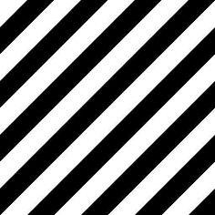


 For example in the first image above, the orientation should all be angled at 45 degrees while in the second image, the orientation map should give evidence of a zig zag pattern.

I will enumerate 3 methods.

1. Fourier Transform.
2. Steerable Pyramids.
3. Histogram of Oriented Gradients.

The best one is ofcourse the last one, but if you read from the starting one, you will get the idea of what we are trying and maybe you can come up with a new method by your own!

## 1. Fourier Transform Method.
This method works best if there is only *one* general orientation in the image. The magnitude of 2d Fourier Transform of the given image will show the direction which is orthogonal to the actual orientation. For example: If you find the 2d fft of the 1st image above and show its magnitude as a grayscale image, you will get something like this:

code in Matlab:

```matlab

close all; clear;

img = imread('images/angled_stripes.jpg');
fftA = fft2(double(img));

figure, imshow(abs(fftshift(fftA)),[24 100000]), colormap gray
title('Image A FFT2 Magnitude')
```
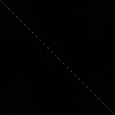

This diagonal line certainly is orthogonal to the direction of the general orientation of the stripes. You can find the direction of this line using some morphological operations and hough transform.

One more example can be seen nicely described in this stackoverflow answer [here](http://stackoverflow.com/questions/20581217/which-way-is-my-yarn-oriented).


However when we are required to deal with images which has more than one general direction associated with it, then it is difficult to decipher all of them out from the 2d fourier transform's magnitude image. For example, if you run the same above matlab code on the zigzag image as of above, the result looks something like this:

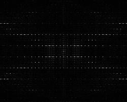.

Though this image has the information about the orthogonal orientations of the zigzag image, getting those directions out of this image is a thing in itself. Moreover, you can see that as we go on increasing the number of directions, this method starts getting complicated.

## 2. Steerable Pyramids.
Oriented filters are used in many vision and image processing tasks, such as texture analysis, edge detection, image data compression, motion analysis, and image enhancement. In many of these tasks, it is useful to apply filters of arbitrary orientation under adaptive control and to examine the filter output as a function of both orientation and phase. Steerable filters are one such kind of orientation filters that can be synthesized efficiently from linear combinations of basis filters, allowing one to adaptively **steer** a filter to any orientation, and the best part is that we can determine the filter output as a function of orientation  *analytically*.

The derivatives of Gaussian function are the most common used steerable filters and we too intend to use one of them. (Note that derivatives of Gaussians of all orders are steerable. For a detailed info, read section 3 from [this][3979dcf3] paper)

For our purpose, we will design a steerable quadrature pair based on the frequency response of the second derivative of Gaussian (denoted ```G2```). A pair of filters is said to be in quadrature if they have the same frequency response but differ in phase by 90 degrees (i.e are Hilbert transforms of each other). Such pairs allow for analyzing spectral strength independent of phase and allow for synthesizing filters of a given frequency response with arbitrary phase.

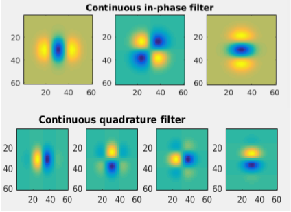

The 4 pairs if written algebraically looks like:

1. ```G2a```+ *i* ```H2a```.
2. ```G2b```+ *i* ```H2b```.
3. ```G2c```+ *i* ```H2c```.
4. ```0```+ *i* ```H2d```.

In the above 4 pairs, you can see that the real part of the 4rth pair is zero and only imaginary part is present.

Steerable filters are useful for many tasks in early vision. In the above mentioned paper, they have used this technique for solving:

1. Orientation and phase analysis.
2. Angularly adaptive filtering.
3. Edge detection.
4. Shape from shading.

We are only interested in the first one, that is analyzing the local orientations of an image.

Without going too much in depth, think of this method as maximizing the orientation energy of each pixel. The specific orientation (theta) which maximizes the orientation strength denotes the orientation of that pixel. For having more granularity in the orientations, we would like to check into more directions when maximizing the orientation energy. This can be set using the nth derivate of a Gaussian and its Hilbert transform as our bandpass filters. Higher the n, more granular the directions will be. In the paper they have derived for 2nd derivate bandpass filter and ran that one an image of Einstein. The results look pretty cool! We will try coding this for our purpose and will see how it looks.

Essentially, we want the output of each of the 7 filters shown above on our images.

In table XI in Appendix I, they have mentioned the analytical equations for finding dominant orientation angle and the orientation strength of each pixel.

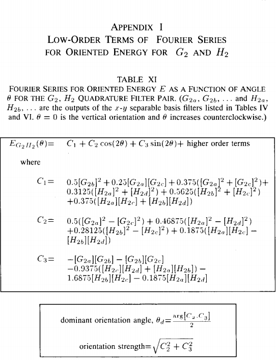

[Appendix I, Table XI, Paper: Freeman and Adelson, Design and Use of Steerable Filters]

Now all we need is the results of applying each of the 7 filters separately on our given image. Find C1, C2 and C3 (as shown in the above figure). And then eventually find the dominant orientation angle for each pixel along with its orientation strength.

Instead of generating each of the 7 filters by myself, I was able to able to find this awesome Matlab Central tool for generating these filters. : [Separable Steerable Pyramid Toolbox by Jeffrey Byrne][46692e76]

Download this Toolbox, add it to your path. Now let's code this whole thing.

```matlab

clc; close all; clear;

addpath('sepspyr/');
im = imread('images/zigzagstripes.jpg');

if(length(size(im))==3)
    res = imresize(rgb2gray(im),0.5);
else
    res = imresize((im),0.5);
end

figure(1); imshow(res);

% function [spyr] = decompose(im, n_levels, n_orientations, spyr_filtertype, spyr_boundary)
spyr = sepspyr.decompose(res, 5, 8, '9iq');
b = spyr.bands;
k=1;
C1 = 0.5.*real(b{k,2}).^2 + 0.25.*real(b{k,1}).*real(b{k,3}) + 0.375.*(real(b{k,1}).^2+real(b{k,3}).^2)+0.3125.*(imag(b{k,1}).^2+imag(b{k,4}).^2)+ ...
    0.5625.*(imag(b{k,2}).^2+imag(b{k,3}).^2)+0.375*(imag(b{k,1}).*imag(b{k,3})+imag(b{k,2}).*imag(b{k,4}));

C2 = 0.5.*(real(b{k,1}).^2-real(b{k,3}).^2)+0.46875.*(imag(b{k,1}).^2-imag(b{k,4}).^2)+0.28125*(imag(b{k,2}).^2-imag(b{k,3}).^2)+ ...
    0.1875*(imag(b{k,1}).*imag(b{k,3})-imag(b{k,2}).*imag(b{k,4}));

C3 = -1.*(real(b{k,1})).*(real(b{k,2}))-(real(b{k,2})).*(real(b{k,3}))-0.9375.*(imag(b{k,3}).*imag(b{k,4}) + imag(b{k,1}).*imag(b{k,2}))- ...
    1.6875.*(imag(b{k,2}).*imag(b{k,3}))-0.1875.*(imag(b{k,1}).*imag(b{k,4}));

theta = atan(C3./C2)./2;

orient_strength = sqrt(C2.^2 + C3.^2);

figure(2);
[h,w]   =   size(theta);
x       =   0:w-1;
y       =   0:h-1;

cos_theta = mat2gray(orient_strength).*cos(theta);
sin_theta = mat2gray(orient_strength).*sin(theta);

quiver(x,y,cos_theta,sin_theta);
axis([0 w 0 h]),axis image, axis ij;

```

You can see that, after calculating the ```theta``` and ```orient_strength``` matrix, I did an element-wise multiplication of the ```orient_strength``` with the angles before showing the orientation map (the quiver plot). What this basically does is, it maps the size of the arrows in the quiver plot according to the strength of that orientation.

Result of the zigzag image looks like this: 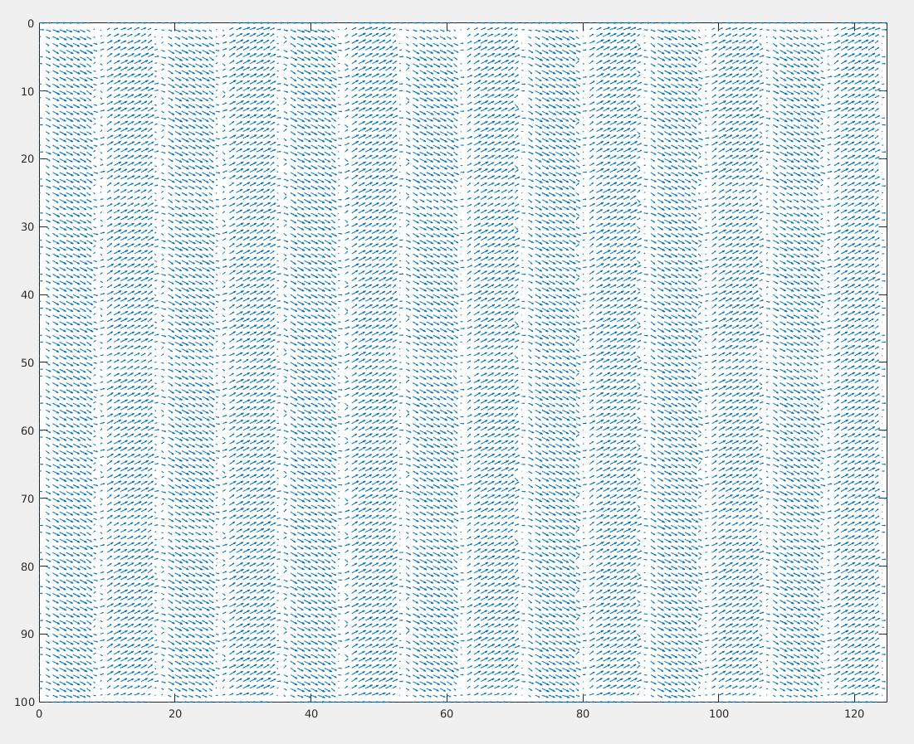

Result on the other 45 degrees angled image, looks like:
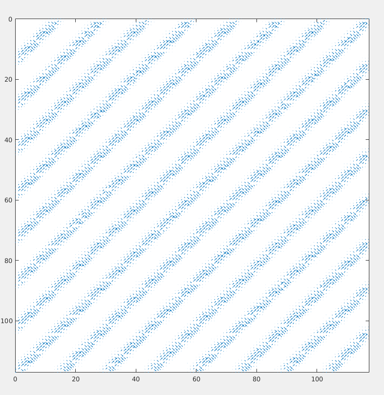

We can observe that it does mistakes in differentiating between orthogonal directions though. Let's try out on some other difficult patterns.

1) Weird Pattern 1.

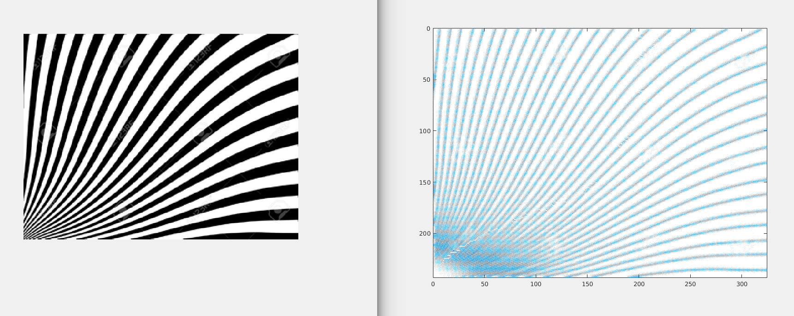

Zoomed version of the result:
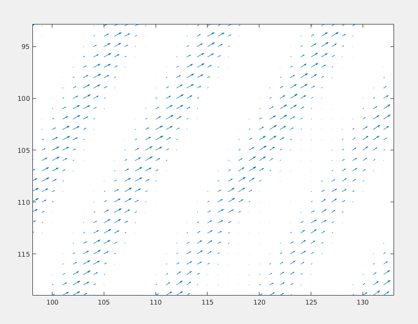

2) Weird Pattern 2.

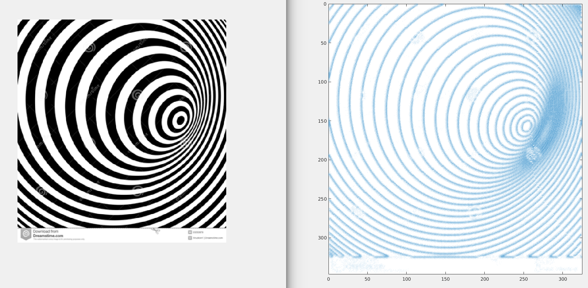

Zoomed version of the result:
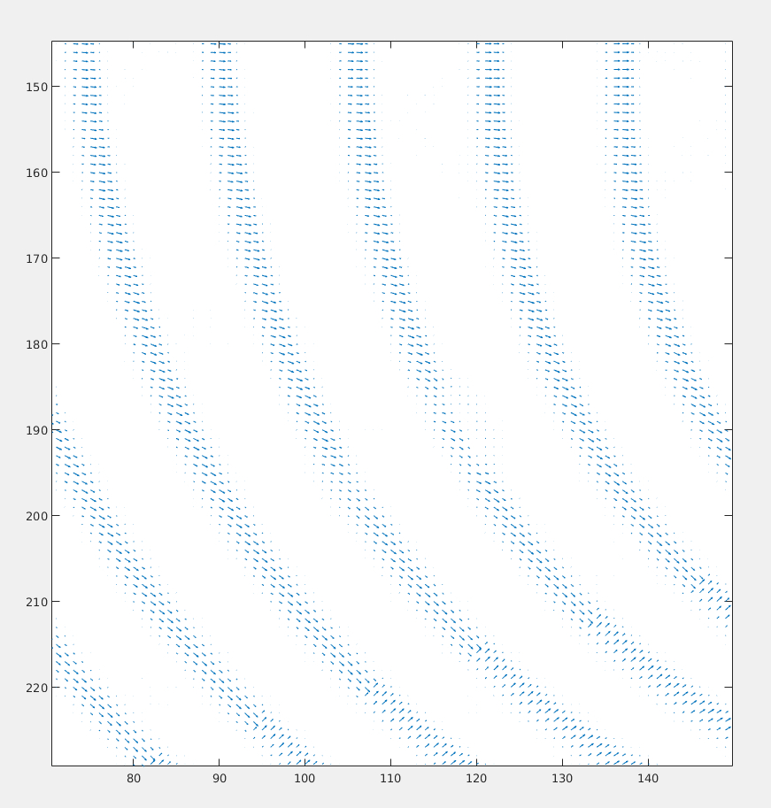


The problem with these filters are that, they are way more local. (One direction for one pixel.) What we wanted was a general orientation that describes at lest an image patch.

## 3. Histogram of Oriented Gradients (HOG Descriptors).

HOG is an orientation based Descriptor. I like to think this as a direct evolution of the steerable filters that we discussed just a while ago. Though created mainly for Pedestrian detection (**[Histograms of Oriented Gradients for Human Detection by Navneet Dalal and Bill Triggs CVPR 2005][01d249e0]** ), it can be used for quantifying orientations of different **patches** of a bigger image.

That's what exactly we intend!

Again, I don't have the computer vision toolbox for Matlab but was able to find a open-source library [VLfeat][fddee31a] which has an [implementation of HOG][4609b606]!. Go through this link as it will help you understand what HOG does here.

Now Download and enable that library by running ```vl_setup.m``` from toolbox folder VLfeat.

Code for visualizing the orientation.

```matlab

im = imread('images/weirdangled_stripes1.jpg');
if(length(size(im))==3)
    im = imresize(rgb2gray(im),0.25);
else
    im = imresize((im),0.25);
end

cellSize = 50 ;
hog = vl_hog(im2single(im), cellSize, 'variant', 'dalaltriggs', 'numOrientations', 9) ;
imhog = vl_hog('render', hog, 'numOrientations', 9, 'variant', 'dalaltriggs') ;

clf ; imagesc(imhog) ; colormap gray ;
```

The results on the 4 images from the start respectively are:

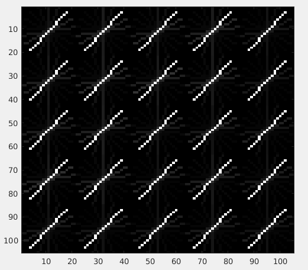

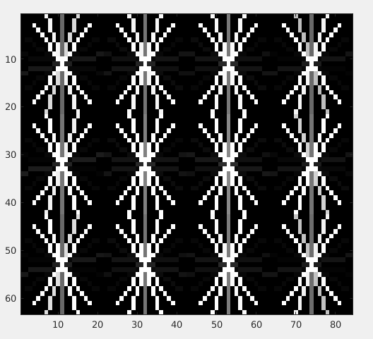

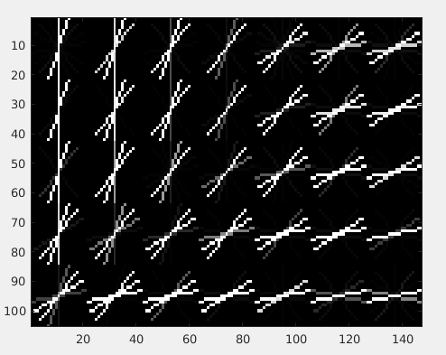

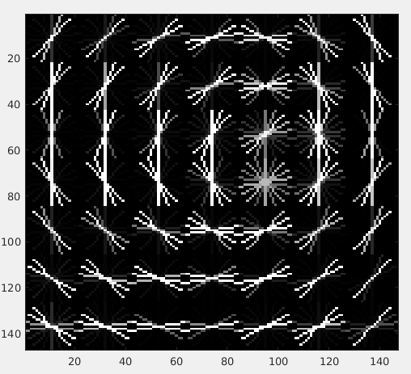

To just draw the maximum orientation per patch instead of drawing all the 9 orientations (as above), try to sum 1st, 10th, 19th and 28th element of the 36 element HOG descriptor to get the orientation strength of the 1st orientation. (90 deg wrt to positive x axis.) Similary do it for all the 9 orientations. Find which one is maximum and use the angle associated with it. The angle difference between each index is ofcourse ```pi/9```.

```
| angle        |1st  | 2nd | 3rd |4rth|  
|--------------|-----|-----|-----|----|
| pi/2         | 1   |  10 | 19  | 28 |
| pi/2-1*pi/9  | 2   |  11 | 20  | 29 |
| pi/2-2*pi/9  | 3   |  12 | 21  | 30 |
| pi/2-3*pi/9  | 4   |  13 | 22  | 31 |
| pi/2-4*pi/9  | 5   |  14 | 23  | 32 |
| pi/2-5*pi/9  | 6   |  15 | 24  | 33 |
| pi/2-6*pi/9  | 7   |  16 | 25  | 34 |
| pi/2-7*pi/9  | 8   |  17 | 26  | 35 |
| pi/2-8*pi/9  | 9   |  18 | 27  | 36 |
```
  [01d249e0]: https://lear.inrialpes.fr/people/triggs/pubs/Dalal-cvpr05.pdf "Histograms of Oriented Gradients for Human Detection by Navneet Dalal and Bill Triggs"
  [4609b606]: http://www.vlfeat.org/overview/hog.html "Tutorial on Hog"
  [fddee31a]: http://www.vlfeat.org/ "VLfeat C and Matlab api"


  [3979dcf3]: http://people.csail.mit.edu/billf/publications/Design_and_Use_of_Steerable_Filters.pdf "Designing Steerable filters"
  [46692e76]: https://www.mathworks.com/matlabcentral/fileexchange/43909-separable-steerable-pyramid-toolbox "SEPSPYR"
